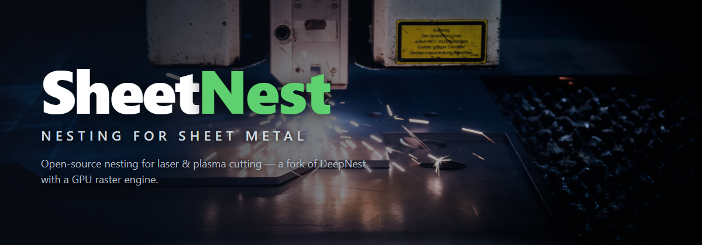
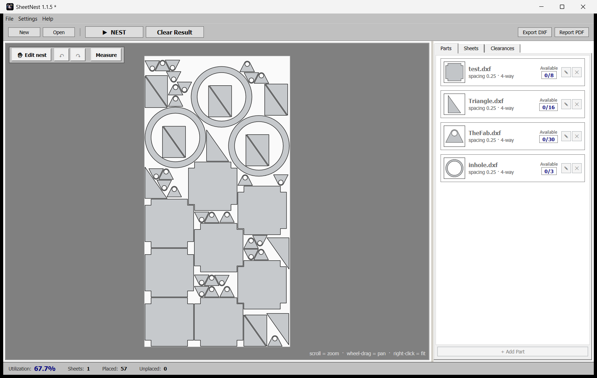
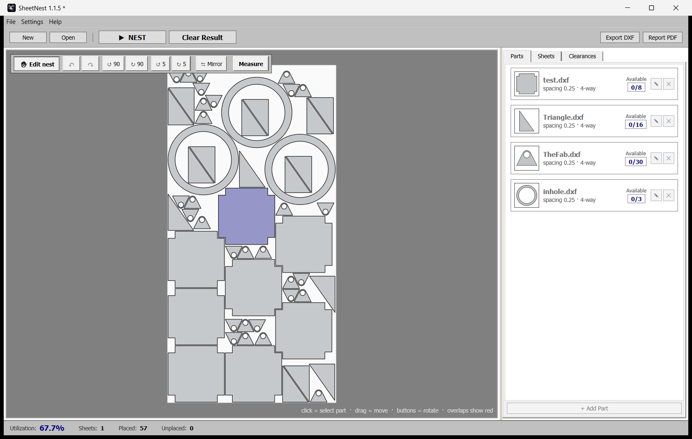

  

  
  

  Free · Windows 10/11, 64-bit · no account, no subscription

# SheetNest — Free nesting software for sheet metal

SheetNest is free nesting software for sheet metal fabrication — it fits your parts onto stock sheets for CNC laser cutting and plasma cutting, on Windows, with no account and no subscription.

If you cut sheet metal, SheetNest helps you get the most parts out of every sheet, buy less material, and hand your machine cut-ready files — all from a simple, one-toolbar app.

## What SheetNest does

- **Fits the most parts on every sheet, automatically** — true-shape nesting packs your parts tightly by their real outline, so you waste less material and buy fewer sheets. Real 800-part jobs nest in seconds.
- **Imports your DXF part drawings** — drop in the DXF files you already have and start nesting.
- **Imports 3D parts and flattens them for you** — bring in a 3D sheet-metal part (STEP or IGES) and SheetNest unfolds it to a flat pattern that's ready to nest. The 3D unfolding engine is built in, runs offline, and needs nothing extra installed. You can set a per-part bend allowance (K-factor) and check the flat length with the built-in Measure tool.
- **Tell it what you need** — enter how many of each part you want (including mirrored copies), and list the sheet sizes and stock you actually have. Save your own sheet-size presets so they're one click next time.
- **Nest with one click, then fine-tune by hand** — let SheetNest lay everything out, then drag, rotate, nudge, and drop parts to contact yourself, with spacing kept safe and full undo/redo.
- **Parts that touch can share one cut** — place matching parts on a shared common line so a single pass cuts both edges. That means less cutting time and even tighter sheets.
- **Picks the best sheet size for you** — stock several sizes and SheetNest puts the bulk on the size that packs densest and the leftovers on the size that wastes least. Standard US sheet sizes are built in, plus your own custom sizes.
- **Exports cut-ready DXF** — one clean DXF per layout, parts only, so your CAM software has nothing extra to trip over. Identical sheets are grouped into a simple "cut N of this layout" plan.
- **One-click PDF report** — a purchasing-ready report showing how much material to buy (sheets per size and total area), the cutting plan, part totals, and a scaled drawing of each layout.
- **Works in inches or millimeters** — switch units to match your shop, with sheets up to 6000 × 2000 mm.
- **Keeps your work safe** — autosave and crash recovery, a backup copy on every save, a Recent Projects list, and double-click a project file to open it right where you left off. Each saved project remembers its own sheet stock and its finished nest.
- **Free and open** — no account, no subscription, no license key. Open-source software you can just use.

## Screenshots

   
  <em>One-click true-shape nesting — your parts packed tight on the sheet, ready to cut.</em>

   
  <em>Fine-tune by hand — select, drag, rotate, mirror, and snap parts to a shared common line.</em>

## Download & install (Windows 10/11, 64-bit)

1. Open the [**latest release**](https://github.com/ManuelMRosa/SheetNest/releases/latest) and download the **`SheetNest-x.y.z-win-x64.msi`** installer.
2. Double-click the `.msi`. It installs **per-user — no admin rights needed** — and adds Start-menu and desktop shortcuts. Installing over an older version upgrades it cleanly.
3. There's **nothing else to install** — the app is self-contained, so you don't need any other download. The 3D unfolding engine is bundled inside, so it runs fully offline.

The first time you launch, Windows may show a **SmartScreen** warning because the app isn't code-signed. Click **More info → Run anyway** to continue.

## License

SheetNest is open-source software released under the MIT License — see [LICENSE](LICENSE).

SheetNest bundles an offline 3D-unfolding engine built from open-source software (FreeCAD and the SheetMetal workbench under the GNU LGPL, and NetworkX under the BSD license) — see [THIRD_PARTY_NOTICES.md](THIRD_PARTY_NOTICES.md) for the full list, licenses and sources.

Building from source? See [BUILDING.md](BUILDING.md).
